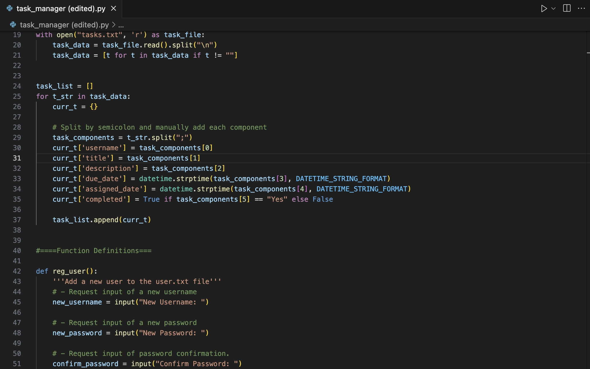

# Task Manager

Code project which manages tasks, enabling users to add, view or edit tasks upon registration. Administrators registered can also display statistics on terminal from generated reports which check users' tasks that are completed, overdue, etc.

## Contents

1. Installation
2. Usage
3. Credits

## Installation

Copy the URL of this repository, then go to your IDE (Visual Studio Code highly recommended) and run a new terminal on an appropriate directory. On your terminal type **git clone _repository URL_** and press ENTER. This will add the repo to your directory. Once you have changed the directory to the newly added folder the program is ready for use.

## Usage

Before using the program make sure that on VSCode you are using at least the basic Python extension so that you can click on the 'play' icon on the top right of the below image to run the code.

Once the program is run it will first tell you to enter your username and then your password. A default username called 'admin' and a default password called 'password' are available which you can use to enter into the respective username and password prompts. Once you are logged in you will encounter a series of options.

The 'Registering a user' option allows you to add a new user to the corresponding textfile user.txt. Through this option you can register yourself by typing in your username and password and once the program is restarted you can log in with your new username and password rather than the defaults mentioned earlier.

The 'Adding a task' option enables you to add a new task, prompting you to give it a name, description, due date and the user to whom you are assigning the task.

'View all tasks' is an option which lists every task that is saved on the textfile tasks.txt which includes the tasks that you have just added.

'View my task' lists every task that is assigned to the user currently logged in. Through the option you are given a prompt to select the task that you want to edit by typing in a number corresponding to your chosen task. Once you have chosen a task the program will then ask you to mark the task as complete or edit it, but the options cannot be done if the task is already marked as complete. Choosing to edit the task allows you to either change the due date of the task or reassign it to a different user.

The 'Generate reports' option enables you to generate statistics of users and tasks which will be found on the textfiles user_overview.txt and task_overview.txt respectively. **Remember that it is important that every textfile that this program generates must be in the same directory as the program file and that your current working directory must also be where the program is in.**

'Display statistics' can only be accessed by the default 'admin' user and with it enables them to view the reports from user_overview.txt and task_overview.txt on the terminal. If the 'Generate reports' option has not yet been executed this option will not be processed.

## Credits

* Editions of 'Registering a user', 'View my task' and 'Display statistics' sections and addition of 'Generate reports' section and functions by JamieCook1517
* Initial collaboration by staff at HyperionDev
